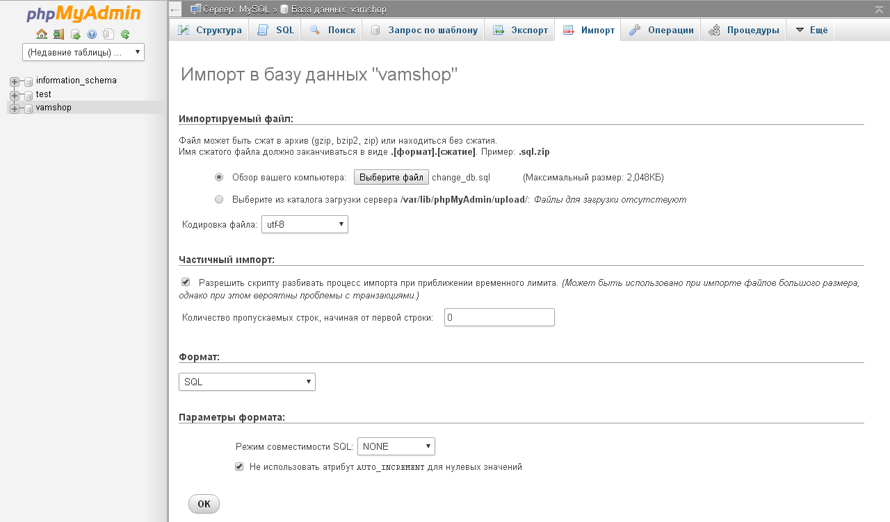
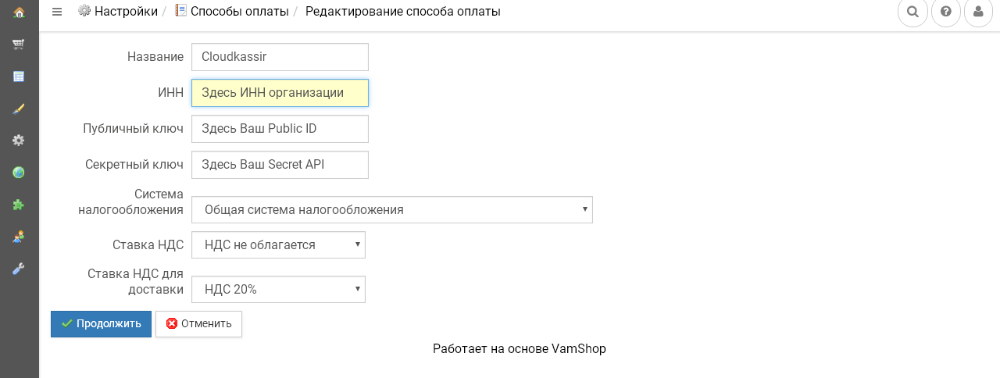
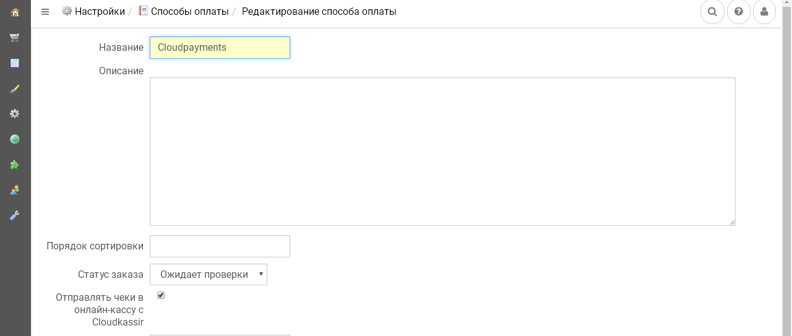
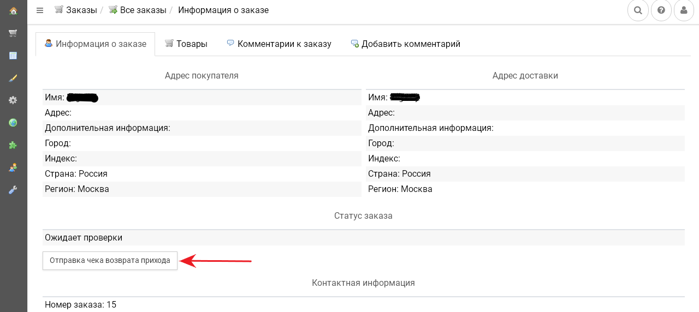

# Онлайн-касса CloudKassir для Vamshop

Сервис [CloudKassir](https://cloudkassir.ru) предоставляет в аренду онлайн-кассы для Вашего интернет-магазина на платформе VamShop в соответствии требованиям ФЗ-54.  
Для корректной работы модуля необходима регистрация в сервисе.
Порядок регистрации описан в [документации CloudKassir](https://cloudkassir.ru/#subscribe).

### Совместимость:
* VamShop 2.60 и выше;

_Если вы используете платежный модуль CloudPayments совместно с модулем CloudKassir, то убедитесь, что в платежном модуле отключена отправка чеков через онлайн-кассу, во избежание дублирования кассовых чеков._

### Возможности:
* Поддержка онлайн-касс (ФЗ-54);
* Фильтр модулей оплаты, для которых необходима отправка электронных чеков;
* Автоматическая отправка чеков прихода по email;
* Автоматическая отправка чеков прихода по SMS;
* Выбор системы налогообложения;
* Выбор НДС для товаров и НДС для доставки отдельно.

## Установка модуля

Для установки модуля необходимо поместить содержимое каталога **/api** из архива в соответствующий каталог на сервере.  
Также необходимо выполнить **sql-запрос к базе данных**. Для этого откройте базу данных вашего сайта в phpMyAdmin на сервере, выберите вкладку ИМПОРТ и загрузите файл **change_db.sql** из архива.

### Техническая настройка
  
### Панель администратора Vamshop
В списке модулей (Настройки -> Способы оплаты) необходимо выбрать из списка и установить способ оплаты Cloudkassir и указать следующие настройки:
* **ИНН** — ИНН организации, на которую зарегистрирована онлайн-касса;
* **Идентификатор сайта** — Public id сайта из личного кабинета CloudPayments;
* **Секретный ключ** — API Secret из личного кабинета CloudPayments;
* **Система налогообложения** — Тип системы налогообложения. Возможные значения перечислены в [документации CloudKassir](https://cloudkassir.ru/Docs/Api);
* **Ставка НДС** — Указание ставки НДС. Все возможные значения указаны в [документации CloudKassir](https://cloudkassir.ru/Docs/Api);
* **Ставка НДС для доставки** — Указание ставки НДС для доставки. Аналогично ставке НДС.

Также активируйте checkbox "Отправлять чеки в онлайн-кассу с Cloudkassir" в настройках тех модулей оплаты, для которых необходима отправка электронных чеков.

После указания всех данных сохраните настройки.

### Личный кабинет CloudPayments
В [личном кабинете CloudPayments](https://merchant.cloudpayments.ru/login) в настройках сайта необходимо включить следующее уведомление:

* **Receipt уведомление**:\
`http(s)://domain.ru/vamshop/payment/cloudkassir/result/`

где **domain.ru** — доменное имя вашего сайта. Во всех случаях требуется выбирать вариант по умолчанию: кодировка — UTF-8, HTTP-метод — POST.

### Возврат прихода
Отправка чеков возврата прихода осуществляется в ручном режиме. Для этого необходимо в списке заказов (Заказы -> Все заказы) выбрать заказ, по которому осуществляется возврат и кликнуть по кнопке "Отправка чека возврата прихода".

